Cloudera Quickstart VM installation instructions
================================================

Please use the following instructions to download and install the Cloudera Quickstart VM with VirutalBox.
The screenshots are from a Mac but the instructions should be the same for Windows. Please see the discussion boards if you have any issues.

1. Install VirtualBox. Go to https://www.virtualbox.org/wiki/Downloads to download and install VirtualBox for your computer.

2. Go to the Cloudera VMS downloads page from https://www.cloudera.com/downloads/quickstart_vms.html and download the file containing the VM. You have to complete some steps: 
    
    * Select VirtualBox platform
    
        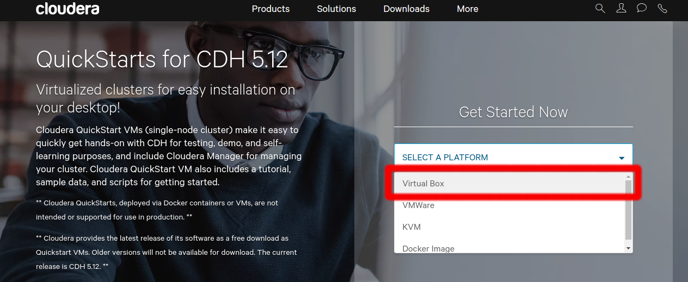 
    
    * Click the "Get it now!" button
    
        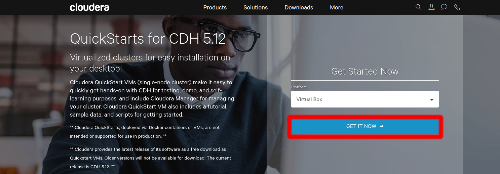
    
    * Fill in form and click "Continue"
    
        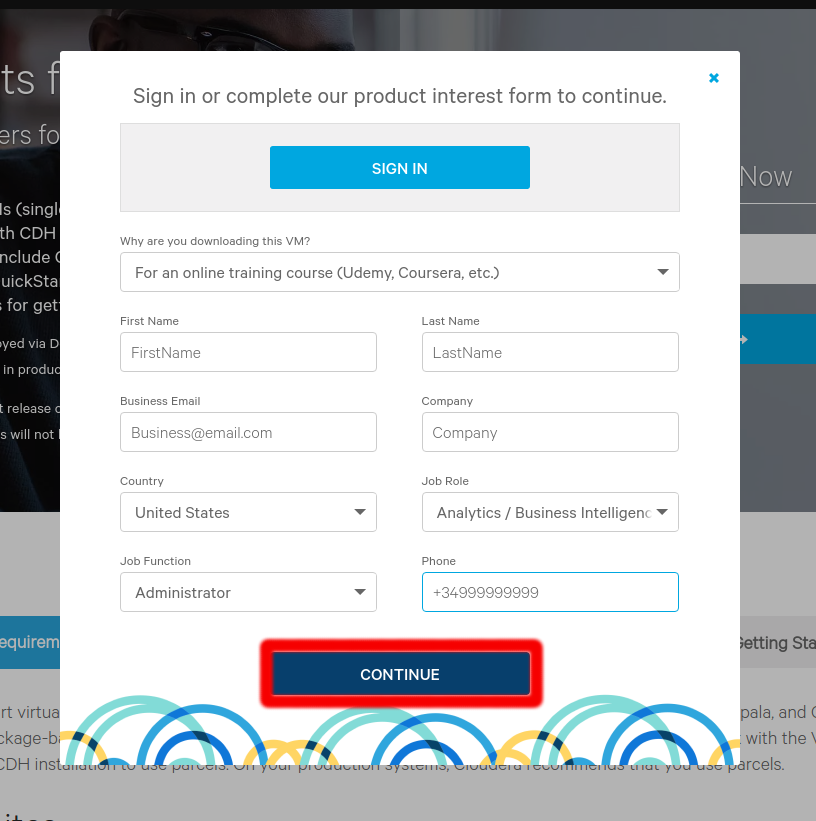
        
    * Accept Terms and Conditions and click "Continue" to start the download.
    
        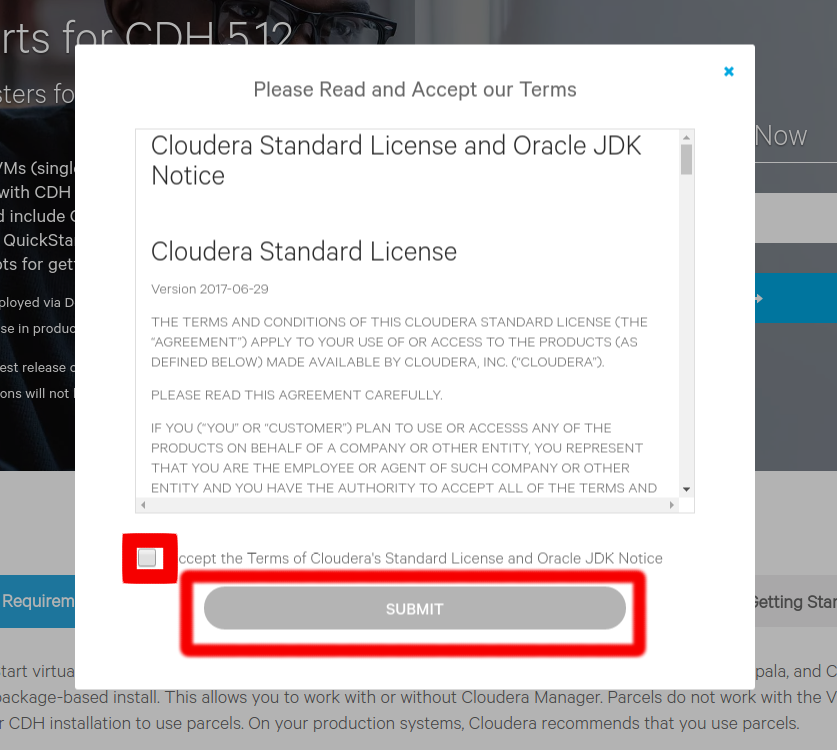
        
    The VM is over 4GB, so will take some time.

3. Unzip the Cloudera VM:

    Right-click cloudera-quickstart-vm-5.4.2-0-virtualbox.zip and select “Extract All…”

4. Start VirtualBox.

5. Begin importing. Import the VM by going to File -> Import Appliance

    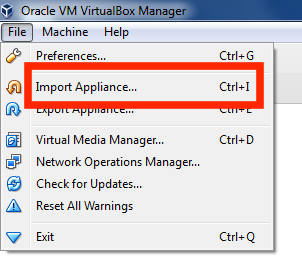

6. Click the Folder icon.

    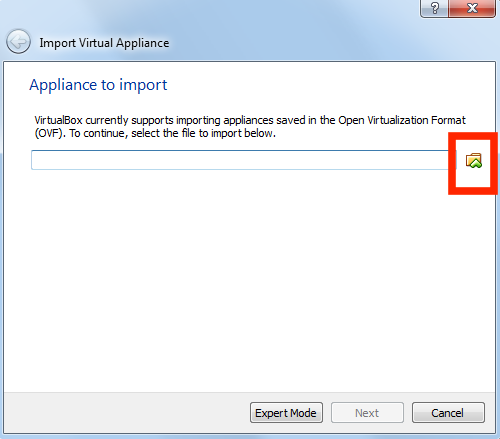

7. Select the cloudera-quickstart-vm-X.X.X-0-virtualbox.ovf from the Folder where you unzipped the VirtualBox VM and click Open.

    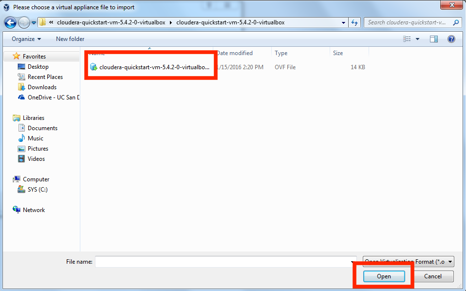

8. Click Next to proceed.

    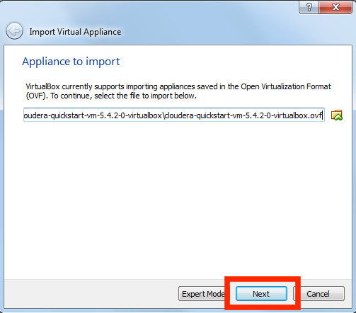

9. Click Import.

    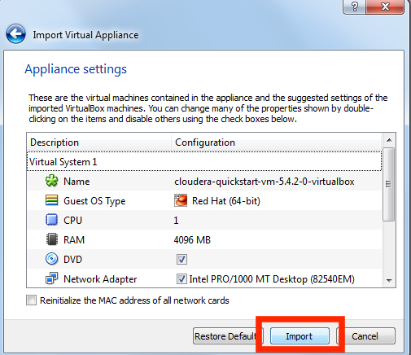

10. The virtual machine image will be imported. This can take several minutes.

    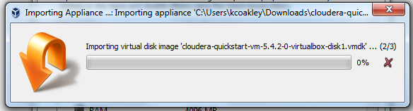

11. Launch Cloudera VM. When the importing is finished, the quickstart-vm-5.4.2-0 VM will appear on the left in the VirtualBox window. Select it and click the Start button to launch the VM.

    

12. Cloudera VM booting. It will take several minutes for the Virtual Machine to start. The booting process takes a long time since many Hadoop tools are started.

    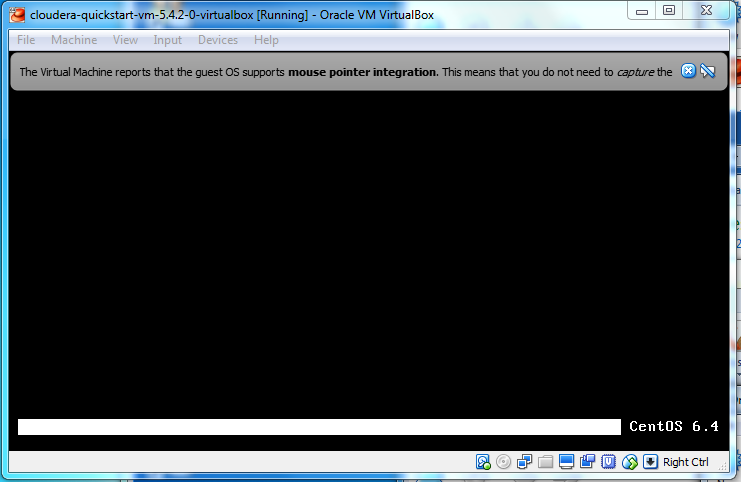

13. The Cloudera VM desktop. Once the booting process is complete, the desktop will appear with a browser.

    

14. Shutting down the Cloudera VM. Before we can change the settings for the Cloudera VM, the VM needs to be powered off. If the VM is running, click on System in the top toolbar, and then click on Shutdown:

	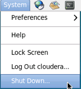

15. Next, click on Shut down:

    

