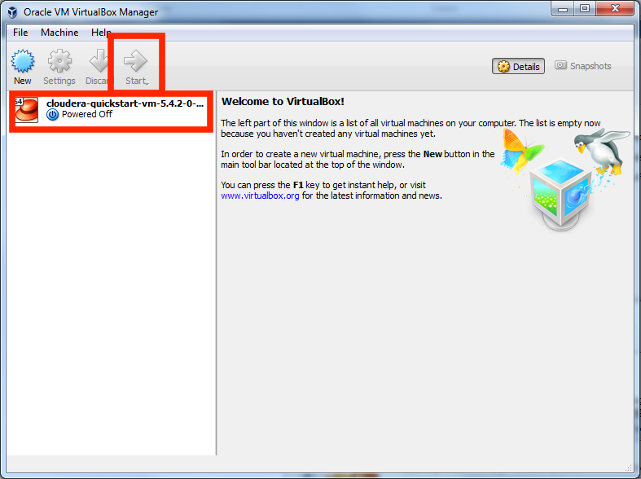
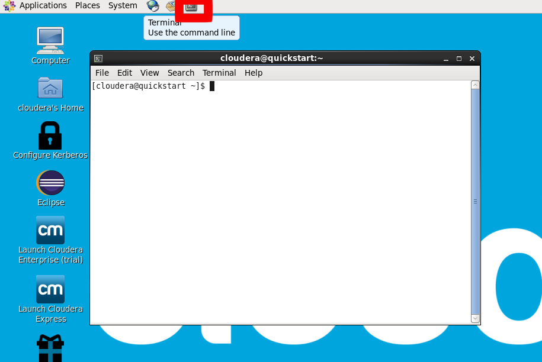
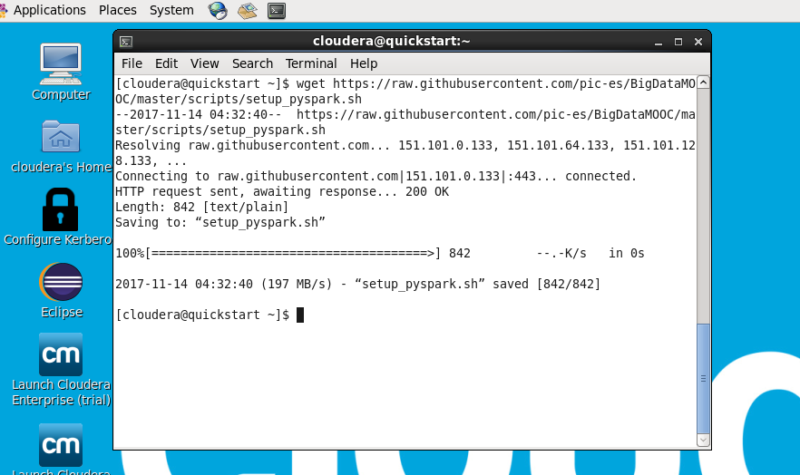
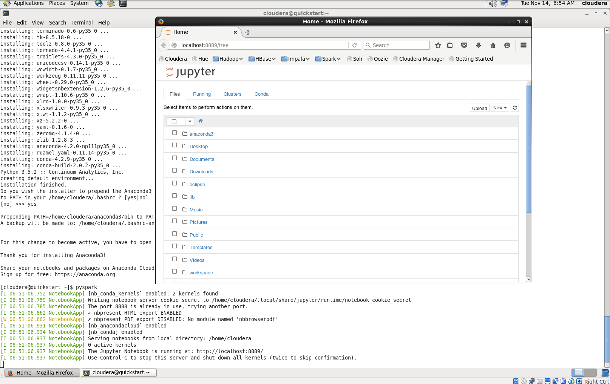

Pyspark setup instructions
==========================

This page will guide you through the installation and configuration of Pyspark in the Cloudera VM.

1. Open VirtualBox and start the Cloudera VM, as you did during the VM installation.

    

2. Open a terminal

    

3. Get the installation script. By running this command in terminal:<p><code>wget https://raw.githubusercontent.com/pic-es/BigDataMOOC/master/scripts/setup_pyspark.sh</code></p>

    

4. Run the installation script and follow the instructions in the screen:
    
    * Run the installation script
        
```
[cloudera@quickstart ~]$ . setup_pyspark.sh
```

    * The script will download the Anaconda package and start its installation:
        
```
% Total    % Received % Xferd  Average Speed   Time    Time     Time  Current
                         Dload  Upload   Total   Spent    Left  Speed
100  455M  100  455M    0     0  11.1M      0  0:00:41  0:00:41 --:--:-- 11.2M

Welcome to Anaconda3 4.2.0 (by Continuum Analytics, Inc.)

In order to continue the installation process, please review the license
agreement.

Please, press ENTER to continue

>>> 
```

    * Press `ENTER` to see the license agreement.
    
```
================
Anaconda License
================

Copyright 2016, Continuum Analytics, Inc.

All rights reserved under the 3-clause BSD License:

Redistribution and use in source and binary forms, with or without
modification, are permitted provided that the following conditions are met:

* Redistributions of source code must retain the above copyright notice,
this list of conditions and the following disclaimer.

* Redistributions in binary form must reproduce the above copyright notice,
this list of conditions and the following disclaimer in the documentation
and/or other materials provided with the distribution.

* Neither the name of Continuum Analytics, Inc. nor the names of its
contributors may be used to endorse or promote products derived from this
software without specific prior written permission.
--More--

```

    * Press `q` to exit the license agreement and proceed to agreing to it.
    
```
Do you approve the license terms? [yes|no]
>>> 
```

    * Type `yes` and press `ENTER`. You will be asked to confirm the installation location.
    
```
Anaconda3 will now be installed into this location:
/home/cloudera/anaconda3

  - Press ENTER to confirm the location
  - Press CTRL-C to abort the installation
  - Or specify a different location below

[/home/cloudera/anaconda3] >>> 
```

    * type `ENTER` to agree with the proposed location and the installation of the packages will start.
    
        Once it finishes you will be asked to prepend the Anaconda install location to the path. By doing this, the python binary inside it will become the default.

```
installing: yaml-0.1.6-0 ...
installing: zeromq-4.1.4-0 ...
installing: zlib-1.2.8-3 ...
installing: anaconda-4.2.0-np111py35_0 ...
installing: ruamel_yaml-0.11.14-py35_0 ...
installing: conda-4.2.9-py35_0 ...
installing: conda-build-2.0.2-py35_0 ...
Python 3.5.2 :: Continuum Analytics, Inc.
creating default environment...
installation finished.
Do you wish the installer to prepend the Anaconda3 install location
to PATH in your /home/cloudera/.bashrc ? [yes|no]
[no] >>> 
```    
 
    * type `yes` and `ENTER` and the installation will be completed. There's no need to open a new terminal. The `setup_pyspark.sh` script takes care of that.
    
```
Prepending PATH=/home/cloudera/anaconda3/bin to PATH in /home/cloudera/.bashrc
A backup will be made to: /home/cloudera/.bashrc-anaconda3.bak


For this change to become active, you have to open a new terminal.

Thank you for installing Anaconda3!

Share your notebooks and packages on Anaconda Cloud!
Sign up for free: https://anaconda.org

```

    * type `pyspark` and `ENTER` to test the Pyspark installation. Once you do this, a browser window with a Jupyter Notebook should open. 
    
        

		
        
