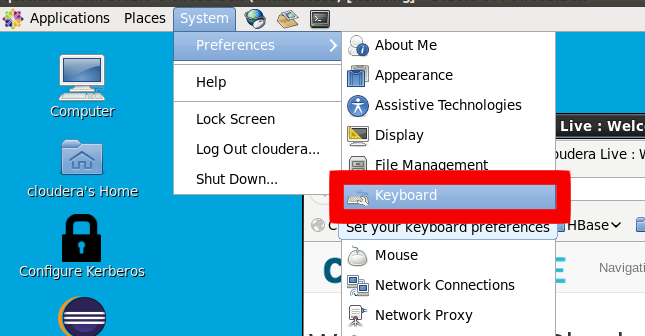
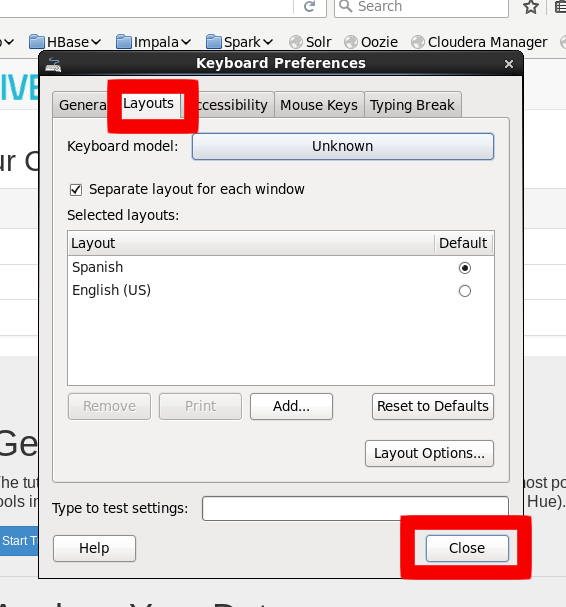
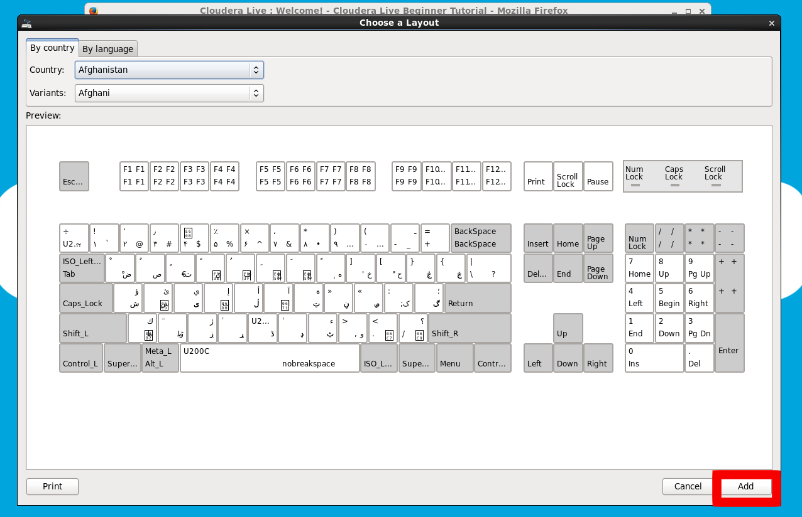
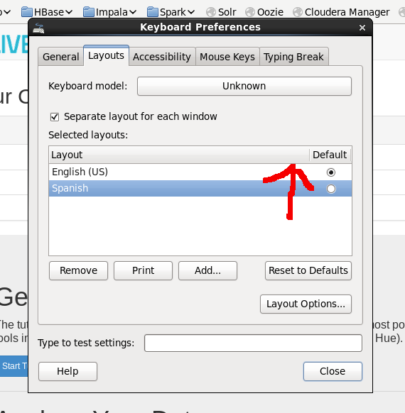
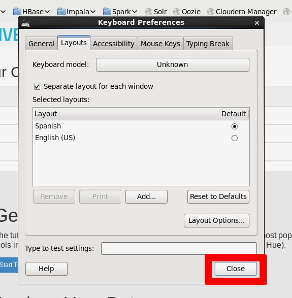
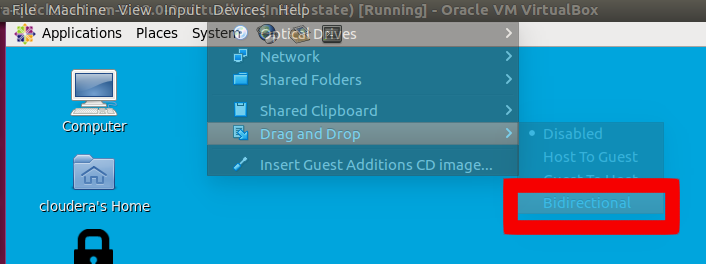
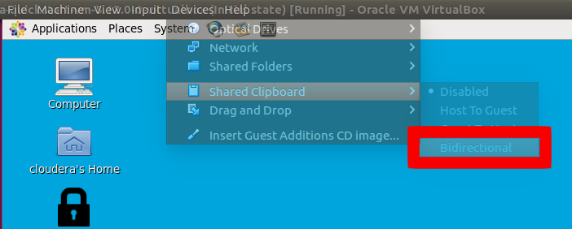

# Tips on Cloudera VM

## Setting up the keyboard layout

You may find that the keyboard layout is not the one you desire. Here's what you have to do to change it:

1. Go to System > Preferences > Keyboard

    

2. Go to the _Layouts_ tab and click _Add_

    

3. Browse the layouts by Country or Language to find the one you want and Click _Add_

    

4. Select the layout you have just added and drag it to the top of the Layouts list.

    

5. Click _Close_ and that's it! 

    
    
## Configure Clipboard and Drag and Drop

If you want to be able to copy-paste from your computer into the VM and vice-versa, as well as dragging files from one side to the other you can:

1. Click on Devices > Drag and Drop > Bidirectional 

    

2. Click on Devices > Shared Clipboard > Bidirectional

    

The menu in your compute may differ slightly from the pictures shown depending on the OS.  