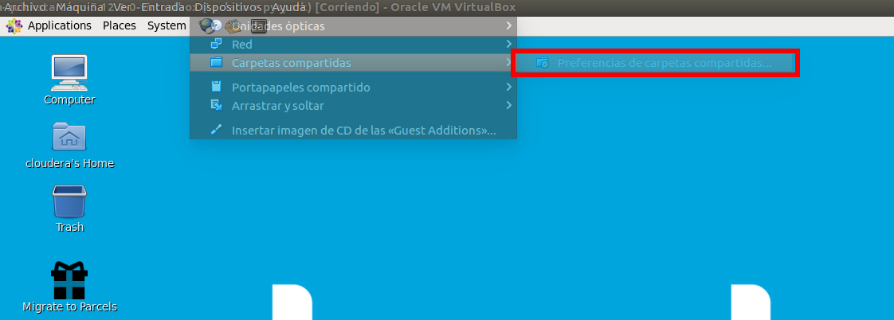
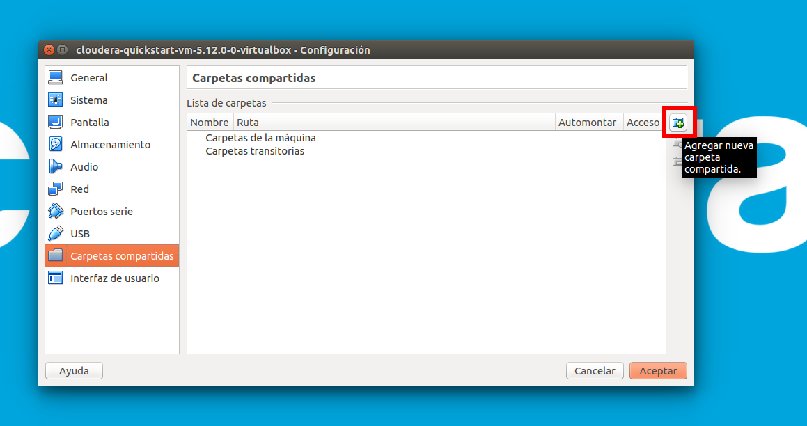
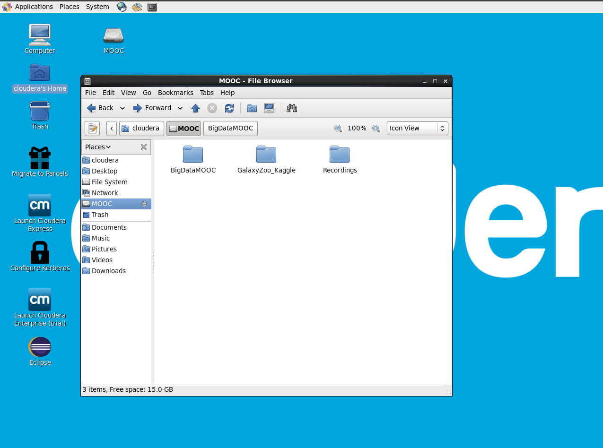
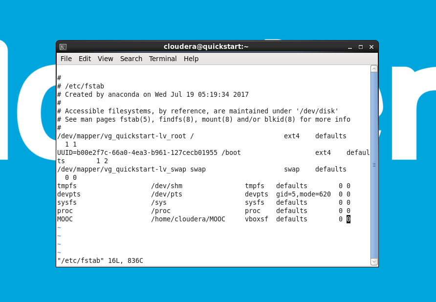

# Consejos para la MV de Cloudera

## Configuración del teclado

Se puede encontrar con que la configuración del teclado no es la que desea. 
A continuación encontrará los pasos necesarios para cambiarla.
Algunos de los textos pueden diferir si previamente ha cambiado el idioma.

1. Vaya a *System > Preferences > Keyboard*

    

2. Vaya a la pestaña *Layouts* y clique *Add*

    

3. Explore las distrivuciones por País y Lengua hasta encontrar la que quiere y haga clic en _Add_

    

4. Seleccione la distribución que acaba de añadir y arrástrela arriba del todo de la lista de Distribuciones.

    

5. Haga clic en _Close_ y ya está! 

    
    
## Configurar Portapapeles y Arrastrar y Soltar

Si quiere tener la posibilidad de copiar y pegar des de su ordenador a la MV y veceversa, así como arrastrat ficheros de un lado a otro, puede:

1. Haga clic en _Devices_ > _Drag and Drop_ > _Bidirectional_ 

    

2. Haga clic en _Devices_ > _Shared Clipboard_ > _Bidirectional_

    

Los menús pueden diferir ligeramente del mostrado dependiendo del SO que use.

 
## Añadir una carpeta compartida y montarla en la máquina virtual

Podemos añadir una carpeta de nuestro ordenador a la máquina virtual para utilizarla para pasar archivos de un sitio a otro.

### Añadimos la carpeta compartida a la máquina virtual

Dentro de la máquina virtual, vamos a: _Dispositivos_ > _Carpetas compartidas_ > _Preferencias de carpetas compartidas ..._

Clicamos para _Agregar una nueva carpeta compartida_

A través del menú desplegable seleccionamos la _Ruta a la carpeta_ de nuestro ordenador que queremos compartir con la máquina virtual,
y le damos un _Nombre de carpeta_ de nuestra elección.

Adicionalmente marcaremos la opción _hacer permanente_ para que la carpeta compartida sea permanente.

Clicamos en _Aceptar_ para cerrar el menú de agregación de carpeta 
y en _Aceptar_ para cerrar el menú de preferencias de carpetas compartidas.

### Montamos la carpeta compartida dentro de la máquina virtual

**Para montar la carpeta solamente para la sesión actual:**

* Abrimos un terminal.

	
	
* Creamos el directorio donde montaremos la carpeta compartida:

	`$ mkdir {vm_folder}`

* Montamos la carpeta compartida

	`$ sudo mount -t vboxsf -o uid=$UID,gid=$(id -g) {shared_folder} {vm_folder}`

Ahora ya podemos visualizarla y acceder a su contenido.

	

**En caso que queramos montarla permanentemente**
debemos incluir el montaje en el fichero /etc/fstab. Seguimos los siguientes pasos:

* Abrimos un terminal

* Editamos el fichero `/etc/fstab` que contiene los montajes como `root`, con el siguiente comando:

	`$ sudo vi /etc/fstab`

* Pulsamos la tecla `i` para entrar en el modo edición y bajamos hasta el final del documento con las flechas de navegación.
* Añadimos la siguiente información al final del fichero para el montaje de la carpeta compartida:

	`{shared_folder}                    {vm_folder}     vboxsf  uid=501,gid=501,defaults        0 0`

	

* Pulsamos `Esc` para salir del modo de edición
* Tecleamos `:wq` e `Intro` para guardar y salir

La próxima vez que paremos y volvamos a encender la máquina virtual, la carpeta compartida ya estará montada en la ubicación 
elegida.

