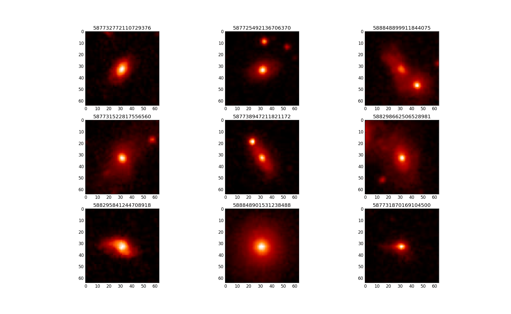
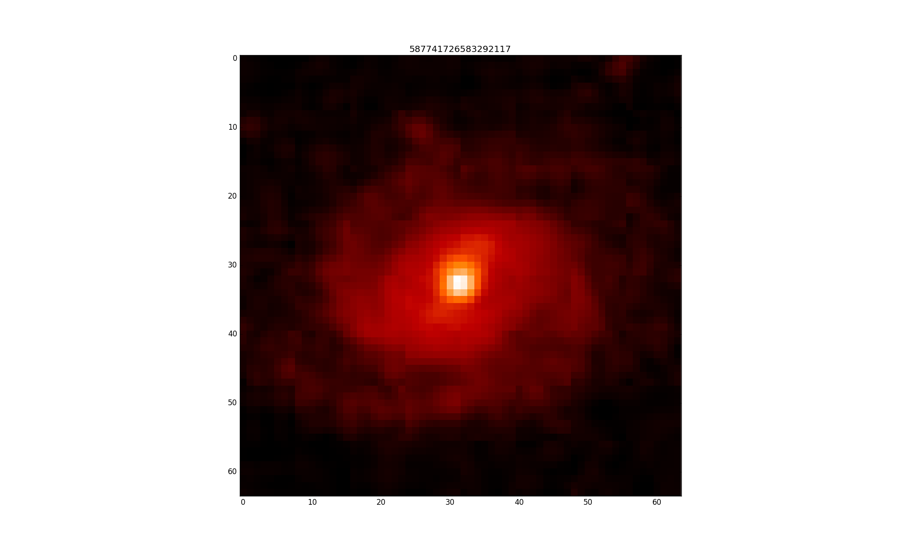
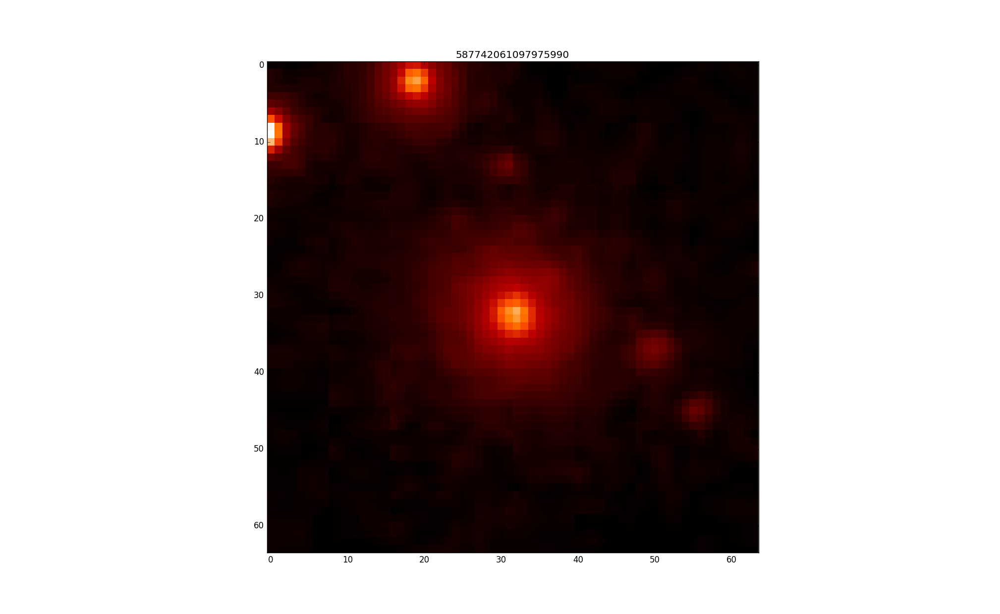

# Preparación del Capstone Project

Todos los datos están almacenados en `/nfs/astro/torradeflot/MOOC/GalaxyZoo1`.
Las rutas a los datos hacen referencia a ubicaciones dentro de esta carpeta.

## Datos GalaxyZoo

Extracción de datos del DR14 de [SkyServer](http://skyserver.sdss.org/dr14/en/tools/search/sql.aspx)

```SQL
Select * from Zoospec
```

* Total de 667944 registros `DR14_ZooSpec.csv`
* Muestra aleatoria de 10.000 registros `DR14_ZooSpec_10000.csv`
* De la anterior muestra, los que están clasificados: `DR14_ZooSpec_10000_classified.csv`

Especificación de los campos en [Sky Server Schema Browser](http://skyserver.sdss.org/dr14/en/help/browser/browser.aspx#&&history=description+zooSpec+U)

---
<h3 color="red" style="color:red;">Alerta!!!</h3>
En algunos casos, los valores de los campos `elliptical` y `spiral`  no se corresponden con su definición. Teóricamente:

* **elliptical**: flag for elliptical - 1 if debiased elliptical fraction > 0.8, 0 otherwise
* **spiral**: flag for combined spiral - 1 if debiased spiral fraction > 0.8, 0 otherwise

En la tabla a continuación se puede ver la correspondencia entre la definición y el valor de los campos.
<table>
<tbody>
	
<tr align="center"><td><font size="-1">result</font></td><td><font size="-1">type_prob</font></td><td><font size="-1">type_raw</font></td><td><font size="-1">N</font></td></tr>
<tr></tr>
<tr align="center" bgcolor="#eeeeff"><td rowspan=3>Coherent values </td><td nowrap=""><font size="-1">uncertain</font></td><td nowrap=""><font size="-1">uncertain</font></td><td nowrap=""><font size="-1">373,719</font></td></tr>
<tr align="center" bgcolor="#eeeeff"><td nowrap=""><font size="-1">spiral</font></td><td nowrap=""><font size="-1">spiral</font></td><td nowrap=""><font size="-1">147,138</font></td></tr>
<tr align="center" bgcolor="#eeeeff"><td nowrap=""><font size="-1">elliptical</font></td><td nowrap=""><font size="-1">elliptical</font></td><td nowrap=""><font size="-1">57,755</font></td></tr>
<tr align="center" bgcolor="#eeeeff"><td rowspan=5>Non coherent values </td><td nowrap=""><font size="-1">uncertain</font></td><td nowrap=""><font size="-1">elliptical</font></td><td nowrap=""><font size="-1">4,435</font></td></tr>
<tr align="center" bgcolor="#eeeeff"><td nowrap=""><font size="-1">elliptical</font></td><td nowrap=""><font size="-1">spiral</font></td><td nowrap=""><font size="-1">165</font></td></tr>
<tr align="center" bgcolor="#eeeeff"><td nowrap=""><font size="-1">uncertain</font></td><td nowrap=""><font size="-1">spiral</font></td><td nowrap=""><font size="-1">42,922</font></td></tr>
<tr align="center" bgcolor="#eeeeff"><td nowrap=""><font size="-1">elliptical</font></td><td nowrap=""><font size="-1">uncertain</font></td><td nowrap=""><font size="-1">28,182</font></td></tr>
<tr align="center" bgcolor="#eeeeff"><td nowrap=""><font size="-1">spiral</font></td><td nowrap=""><font size="-1">uncertain</font></td><td nowrap=""><font size="-1">13,628</font></td></tr>

</tbody></table>

Dónde `type_prob`  es el tipo de galaxia extraído de las probabilidades `p_cs_debiased` y `p_el_debiased` y
y `type_raw` es  el tipo informado en la tabla ZooSpec.

Sugiero ignorar los campos `elliptical` y `spiral` y utilizar únicamente los campos `p_cs_debiased` y `p_el_debiased`
Utilizando estos para el cálculo del target sobre `DR14_ZooSpec_10000.csv` queda:

<table>
<tr><td>spiral</td><td>2,410</td></tr>
<tr><td>elliptical</td><td>1,291</td></tr>
<tr><td>uncertain</td><td>6,299</td></tr>
</table>

---

## Imágenes de muestra

Algunas imágenes jpeg de muestra se han descargado en `images`:
```
images
└── 0.4
    ├── 16x16
    ├── 32x32
    └── 64x64
```
Corresponden a objetos seleccionados aleatoriamente de entre los del Galaxy Zoo, con pixel scale=0.4 y tamaño 16x16, 32x32 o 64x64 píxeles.

```
# /image_script.py get_jpegs -o /nfs/astro/torradeflot/MOOC/GalaxyZoo1/DR14_ZooSpec.csv -n 100 -f /nfs/astro/torradeflot/MOOC/GalaxyZoo1
# /image_script.py get_jpegs -o /nfs/astro/torradeflot/MOOC/GalaxyZoo1/DR14_ZooSpec.csv -n 100 -f /nfs/astro/torradeflot/MOOC/GalaxyZoo1 -d 32
# /image_script.py get_jpegs -o /nfs/astro/torradeflot/MOOC/GalaxyZoo1/DR14_ZooSpec.csv -n 100 -f /nfs/astro/torradeflot/MOOC/GalaxyZoo1 -d 16
```

## Imágenes como arrays

1. Dividir el csv con datos del Galaxy Zoo en chunks:

    `./image_script.py split_csvs -o /nfs/astro/torradeflot/MOOC/GalaxyZoo1/DR14_ZooSpec_10000.csv -c 100 -d /tmp`

2. Para cada fichero recoger las imágenes de todos los objetos y guardarlo en un csv

    `./image_script.py get_features -o /tmp/{file_name}`
    
    Este csv tendrá 64*64 + 1 = 4097 campos.

3. Hacer merge de todos los ficheros de features:

    `./image_script.py merge_csvs -o /tmp/{f1},...,/tmp/{fn} -d /nfs/astro/torradeflot/MOOC/GalaxyZoo1/F_DR14_ZooSpec_10000.csv`

4. Filtrar solamente las imágenes clasificadas. El fichero de salida tiene un tamaño de 600MiB e incluye también imágenes que no han
sido satisfactoriamente clasificadas. Esto quiere decir que no tienen almenos un 80% de votos en uno de los sentidos. Éstas imágenes
no van a ser utilizadas para la clasificación, así que para el entreno y validación del modelo las podemos filtrar.

    Seleccionamos aquellos objetos de `ZooSpec` con `spiral==1` o `elliptical==1` y nos quedan 3788 registros y el fichero de features se "reduce" a 200MiB.

    Los datos filtrados son: `DR14_ZooSpec_10000_classified.csv` i `F_DR14_ZooSpec_10000_classified.csv`


## Generación de imágenes a partir de csv

1. Generación de un sample aleatorio de imágenes
    `./image_script.py plot_sample_images -o /nfs/astro/torradeflot/MOOC/GalaxyZoo1/F_DR14_ZooSpec_10000.csv -s 3,3`

    

2. Generación de la imagen de una galaxia por su id:

    `./image_script.py plot_sample_images -o /nfs/astro/torradeflot/MOOC/GalaxyZoo1/F_DR14_ZooSpec_10000.csv -i 587741726583292117`

	<table>
		<tr>
			<td></td>
			<td></td>	
		</tr>
	</table>

## Generación de datos de votos buenos

A partir de los campos `p_cs_debiased` y `p_el_debiased` se ha generado una base de datos ficticia de votos.

```./votes.py generate_good_votes -o /nfs/astro/torradeflot/MOOC/GalaxyZoo1/DR14_ZooSpec_10000.csv -d /nfs/astro/torradeflot/MOOC/GalaxyZoo1/DR14_ZooSpec_10000_good_votes.csv
```

Este script genera un fichero csv de votos con los campos:
* dr7objid
* user_id: identificación del usuario que ha hecho el voto
* 1 o 0: sentido del voto 1=espiral, 0=elíptica

## Comprobación de coherencia de los datos de votos

El mismo script tiene un método para comprobar que las clasificaciones obtenidas a partir de los votos serán 
las mismas que se obtienen de los datos de ZooSpec:

```
./votes.py check_votes -o /nfs/astro/torradeflot/MOOC/GalaxyZoo1/DR14_ZooSpec_10000.csv -v /nfs/astro/torradeflot/MOOC/GalaxyZoo1/DR14_ZooSpec_10000_good_votes.csv
NO errors for fields votes_el and or_el
NO errors for fields votes_cs and or_cs
NO errors for fields votes_uc and or_uc
```

## Generación de datos de votos malos

### Usuarios con voto contrario a la mayoría

El script provee un método para la generación de usuarios que muestran un perfil de voto alejado de la media.
O sea, usuarios que votan frecuentemente en sentido contrario a la mayoría de gente y que, por lo tanto,
son susceptibles de generar votos inválidos.

Para a generación de estos usuarios se realizan varios pasos:
* se calcula el voto medio de cada imagen `mi`.
* se calcula la "varianza" respecto a la media de cada usuario: `sum((vi - mi)**2)/n` donde `vi` es el voto del 
usuario para la imagen `i` y `n` es el número de votos del usuario.
* se generan un numero aleatorio de usuarios malos con un "varianzas" superiores a un límite.
* el fichero de salida contiene tanto los usuarios "buenos" como "malos"

```
./votes.py add_bad_votes -o /nfs/astro/torradeflot/MOOC/GalaxyZoo1/DR14_ZooSpec_10000_good_votes.csv \
     -d /nfs/astro/torradeflot/MOOC/GalaxyZoo1/DR14_ZooSpec_10000_good_and_bad_votes.csv
```
