# Ejercicios

__1. Descarga de los datos__

Arrancar la maquina virtual. Abrir una consola de comando y desde la home descarga la carpeta que contiene los datos que se van a utilizar con el siguiente comando:

`wget path`

__2. Registro de los datos en el HDFS__

Una vez que los ficheros estén guardados en la maquina virtual, hay que registrar los ficheros *.csv en el sistema de ficheros con el siguiente comando:

`hdfs fs copy`

Para comprobar que se haya registrado correctamente, ejecuta este comando y comprueba que en la lista de ficheros que devuelve están los ficheros que has registrado previamente:

`hdfs ls`

__3. Exploración de los datos__

La exploración de datos en formato csv se puede llevar al cabo muy facilmente cargandolos en un dataframe.
Abrir el notebook Spark con el comando:
`spark notebook command` 

* Ejecutar el siguiente codigo para explorar las primeras lineas del fichero a:

`pd.head(5)`

__Pregunta__ Cuantas columnas tiene el fichero a?

* Exlorar el fichero b: cargarlo en un dataframe (como con el fichero a) y explorar las primeras lineas del dataframe
Para saber cuantas filas contiene se pueden usar distintos metodos: haver una consulta en Hive o utilizando pandas.
Selecciona el metodo que mejor conoces para contestar a la siguiente pregunta.

__Pregunta__ Cuantas filas contiene el fichero b?

__Pregunta__ Cuantos valores validos (no NaNs) contiene la columna x del fichero b? (ejemplo:usar la función numpy.isfinite())

__Pregunta__ Que columna del fichero a contiene valores también contenidos en el fichero b? Como se llama la columna del fichero b? Que representa?

* Exploración de las imagenes de galaxias
En la carpeta imagenes/ se encuentran ficheros con la imagenes de las galaxias que hay que clasificar. Las imagenes se pueden ver ejecutando el comando por consola
`command jpg`
Mirar las imagenes para ver si es posible reconocer los distintos tipos (elípticas, espirales), así como explicado en la introducción.

__Pregunta__ Abre la imagen correspondiente a la entrada numero 2 del fichero a. De que tipo es?

__Ejercicio__ 
## Dataset de imágenes de galaxias

Las imágenes de galaxias tomadas por nuestro telescopio son procesadas y almacenadas como 
imágenes JPEG de 64x64 píxeles en color como éstas:

<table style="width:50%; margin-left:auto; margin-right:auto;" >
<tr>
<td align="center">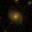</td>
<td align="center">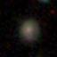</td>
<td align="center">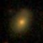</td>
<td align="center"></td>
</tr>
<tr>
<td align="center">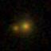</td>
<td align="center">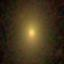</td>
<td align="center">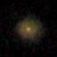</td>
<td align="center">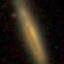</td>
</tr>
<tr>
<td align="center">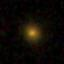</td>
<td align="center">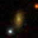</td>
<td align="center">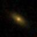</td>
<td align="center">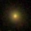</td>
</tr>
<tr>
<td align="center">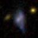</td>
<td align="center">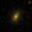</td>
<td align="center">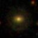</td>
<td align="center">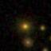</td>
</tr>
</table>

La mayoría de algoritmos de Machine Learning necesitan que los datos esten 
organizados de forma tabular, con las observaciones (imágenes en nuestro caso) distribuidas por filas
y los parámetros (píxeles) de cada observación en columnas.

Así pues, hemos convertido cada una de las imágenes en un vector de 64*64=4096 posiciones,
con los siguientes pasos:

* **Convertir la imagen en color en una imagen en blanco y negro.** Cada uno de los píxeles de la 
imagen contiene 3 valores entre 0 y 255 correspondientes a los 3 canales RGB (R=Rojo, G=Verde, 
B=Azul). Podríamos decir que cada imagen está compuesta por tres matrices 64x64: `MR`, `MG` y `MB`,
correspondientes a los canales R, G y B respectivamente. Aplicamos la siguiete fórmula para
fusionar las tres matrices en una sola matriz (`M`) en tonos de gris.

  ``` M = 0.2989 * MR + 0.5870 * MG + 0.1140 * MB```

* **"Aplanar" la matriz a un vector** Reorganizamos los valores de la matriz `M` de dimensiones 64x64

<table style="border-collapse: collapse; margin-left:auto; margin-right:auto;">
<tr><td style="border: 1px solid black;">1_1</td><td style="border: 1px solid black;">1_2</td><td style="border: 1px solid black;">1_3</td><td style="border: 1px solid black;">1_4</td><td style="border: 1px solid black;">...</td><td style="border: 1px solid black;">1_64</td></tr>
<tr><td style="border: 1px solid black;">2_1</td><td style="border: 1px solid black;">2_2</td><td style="border: 1px solid black;">2_3</td><td style="border: 1px solid black;">2_4</td><td style="border: 1px solid black;">...</td><td style="border: 1px solid black;">2_64</td></tr>
<tr><td style="border: 1px solid black;">3_1</td><td style="border: 1px solid black;">3_2</td><td style="border: 1px solid black;">3_3</td><td style="border: 1px solid black;">3_4</td><td style="border: 1px solid black;">...</td><td style="border: 1px solid black;">3_64</td></tr>
<tr><td style="border: 1px solid black;">4_1</td><td style="border: 1px solid black;">4_2</td><td style="border: 1px solid black;">4_3</td><td style="border: 1px solid black;">4_4</td><td style="border: 1px solid black;">...</td><td style="border: 1px solid black;">4_64</td></tr>
<tr><td style="border: 1px solid black;">...</td><td style="border: 1px solid black;">...</td><td style="border: 1px solid black;">...</td><td style="border: 1px solid black;">...</td><td style="border: 1px solid black;">...</td><td style="border: 1px solid black;">...</td></tr>
<tr><td style="border: 1px solid black;">64_1</td><td style="border: 1px solid black;">64_2</td><td style="border: 1px solid black;">64_3</td><td style="border: 1px solid black;">64_4</td><td style="border: 1px solid black;">...</td><td style="border: 1px solid black;">64_64</td></tr>
</table>

> A una tupla de longitud 4096 como sigue:

<table style="border-collapse: collapse; margin-left:auto; margin-right:auto;">
<tr>
<td style="border: 1px solid black;">1_1</td>
<td style="border: 1px solid black;">1_2</td><td style="border: 1px solid black;">...</td><td style="border: 1px solid black;">1_64</td><td style="border: 1px solid black;">2_1</td><td style="border: 1px solid black;">2_2</td><td style="border: 1px solid black;">...</td><td style="border: 1px solid black;">2_64</td><td style="border: 1px solid black;">...</td>
<td style="border: 1px solid black;">64_64</td>
</tr>
</table>

* **Normalización** Algunos algoritmos funcionan mejor si todas las variables se encuentran dentro del mismo
rango de valores, típicamente [-1, 1] o [0, 1], por este motivo, dividimos los valores por 255.

Este procedimiento ya ha sido llevado a cabo para todas las imágenes y el resultado 
lo podéis encontrar en: `/nfs/astro/torradeflot/MOOC/GalaxyZoo1/F_DR14_ZooSpec_10000.csv`

__Ejercicio__

Convertir las imágenes en la carpeta
/nfs/astro/torradeflot/MOOC/GalaxyZoo1/images/0.4/64x64/
a un csv con la infor dr7objid y 4096 features


